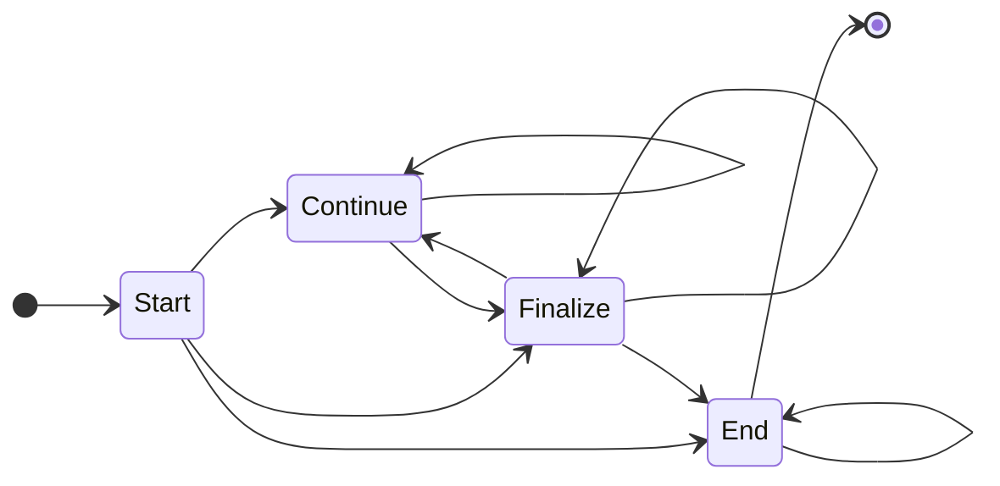

# Keccak256 For Variable Length Input

We describe the circuit that can process inputs of an arbitrary size.

## Plain Keccak behavior

Keccak256 uses a simple iterating sponge construction to handle a variable length input. The sponge absorbs 17 words(136 bytes) of inputs, applies the `Keccak-f` permutation, and then absorb next 17 words. Once all parts of the inputs are absorbed, the sponge squeezes out the 32 bytes for the output.

No matter what input is, the padding must be applied. The padding is a multi-rate padding, it pads single bit 1 followed by minimum number of bits 0 followed by a single bit 1, such that the result is 136 bytes.

## Circuit behavior

### Gadget: Keccak Output Lookup

Each row other than the first is corresponding to a `Keccak-f` permutation round.

We define these state tags
- Start: A dummy tag for the first row.
- Continue: Absorbs the current input and permutes state.
- Finalize: Does the same but it marks the state output is usable for the consumer.
- End: The rest of the unused rows.



#### State transition


We leave an empty row at the top of the table for usage that disables the lookup. Use a separate selector `q_start` for this row.

This region splits the input to multiple parts, each part corresponds to their `Keccak-f` permutation round.
This is also a lookup table for the other circuits to lookup the Keccak256 input to the output.

Columns:

- `state_tag` either 0=Start, 1=Continue, 2=Finalize, 3=End
- `input_len`: int. The length of the input.
- `input`: RLC of 136 bytes. 136 bytes to be absorbed in this round. Padding not included yet.
- `perm_count`: int. Permutations we have done after the current one.
- `input_rlc`: RLC. Accumulatd bytes by random linear combination (in big-endian order)
- `output` RLC of 32 bytes. The base-2 `state[:4]` output from this round `keccak_f`

| state_tag | input_len | input | perm_count | input_rlc | output |
| --------: | --------: | ----: | ---------: | --------: | -----: |
|     Start |         0 |     0 |          0 |         0 |      0 |
|  Finalize |        20 |       |          1 |           |        |
|  Continue |       150 |       |          1 |           |        |
|  Finalize |       150 |       |          2 |           |        |
|  Finalize |         0 |       |          1 |           |        |
|  Continue |       136 |       |          1 |           |        |
|  Finalize |       136 |     0 |          2 |           |        |
|       End |           |       |          0 |         0 |        |

#### Checks

We branch the constraints to apply by state_tag

- Start
  - input_len === input === perm_count === input_rlc === output === 0
  - State transition
    - next.state_tag in (Continue, Finalize, End)
- Continue
  - if input_len === 136 * (perm_count + 1) absorb a full block of 0x80...0x01
    - next.input === 0 (since the input is the unpadded input)
    - next.state_tag === Finalize
  - Next row validity
    - next.input_rlc === curr.input_rlc * r**136 + next.input
    - next.perm_count === curr.perm_count + 1
  - State transition
    - next.state_tag in (Continue, Finalize)
- Finalize
    - This is a valid place to finalize
        - (curr.perm_count * 136 - input_len) in 1~136
    - Next row validity
        - next.perm_count === 1
        - next.input_rlc === next.input
    - State transition: (Continue, Finalize, End) all 3 states allowed
- End
    - We can broadcast this state_tag to the `keccak_f` as a flag to disable all checks.
    - State transition: next.state_tag === End


#### Lookup

To lookup the Keccak256 input to the output, query the following columns:

- `state_tag`
- `input_len`: FQ. This is required because input \[0, 0, 0\] and \[0, 0\] have the same RLC value but different keccak hash outputs.
- `input_rlc`: RLC
- `output`: RLC

When the lookup is needed, constrain `state_tag === 2 (Finalize)`.

### Gadget: Padding Validator

When the state_tag is Finalize, we activate this region to check the padded input.

#### Plain behavior: The padding rule

```python
def get_padding(input_len: int, perm_count: int) -> bytes:
    """
    output big-endian bytes
    """
    acc_len = (perm_count - 1) * 136
    # note that diff is at maximum 135
    diff = input_len - acc_len
    if diff == 0:
        # pad the next full block
        return [0x80] + ([0x00] * 134) + [0x01]
    elif diff == 1:
        # pad 0b10000001
        return [0x81]
    elif 1 < diff < 136:
        return [0x80] + ([0x00] * int(diff - 2)) + [0x01]
    else:
        raise ValueError("unreachable")
```

#### Circuit

The Padding Region is a 136-row region.

- `f_enable` a flag that's 1 when `state_tag === Finalize`. It would be all 1 or all 0 in all rows, so we don't show it in the examples.
- `byte` individual byte of the input in big-endian
- `input_len` Length for correct padding
- `acc_len` How many bytes we have processed.
- `diff_is_zero`: Returns 1 if `input_len - acc_len` is 0. Otherwise, it is 0. This is achived using an IsZero gadget.
- `padded_byte` Mostly the same as the original `byte` but padded
- `is_pad_zone` A flag to define the rows that `byte` should be 0
- `byte_RLC` This accumulate `byte` into RLC

| offset | byte | input_len | acc_len | diff_is_zero | padded_byte | is_pad_zone | byte_RLC |
| -----: | :--- | --------: | ------: | -----------: | :---------- | ----------: | -------- |
|      0 | 0xff |       250 |     136 |              | 0xff        |           0 |          |
|      1 | 0xff |       250 |     137 |              | 0xff        |           0 |          |
|    ... | ...  |       ... |     ... |              | ...         |           0 |          |
|    113 | 0xff |       250 |     249 |              | 0xff        |           0 |          |
|    114 | 0x00 |       250 |     250 |            1 | 0x80        |           1 |          |
|    115 | 0x00 |       250 |     251 |              | 0x00        |           1 |          |
|    ... | ...  |       ... |     ... |          ... | ...         |         ... |          |
|    134 | 0x00 |       250 |     270 |              | 0x00        |           1 |          |
|    135 | 0x00 |       250 |     271 |              | 0x01        |           1 |          |

The full-pad case

| offset | byte | input_len | acc_len | diff_is_zero | padded_byte | is_pad_zone | byte_RLC |
| -----: | :--- | --------: | ------: | -----------: | :---------- | ----------: | -------- |
|      0 | 0x00 |       136 |     136 |            1 | 0x80        |           1 |          |
|      1 | 0x00 |       136 |     137 |              | 0x00        |           1 |          |
|    ... | ...  |       ... |     ... |          ... | ...         |         ... |          |
|    134 | 0x00 |       136 |     270 |              | 0x00        |           1 |          |
|    135 | 0x00 |       136 |     271 |              | 0x01        |           1 |          |

The 0x81 case

| offset | byte | input_len | acc_len | diff_is_zero | padded_byte | is_pad_zone | byte_RLC |
| -----: | :--- | --------: | ------: | -----------: | :---------- | ----------: | -------- |
|      0 | 0xff |       271 |     136 |              | 0xff        |           0 |          |
|      1 | 0xff |       271 |     137 |              | 0xff        |           0 |          |
|    ... | ...  |       ... |     ... |          ... | ...         |           0 |          |
|    113 | 0xff |       271 |     249 |              | 0xff        |           0 |          |
|    114 | 0xff |       271 |     250 |              | 0xff        |           0 |          |
|    115 | 0xff |       271 |     251 |              | 0xff        |           0 |          |
|    ... | ...  |       ... |     ... |          ... | ...         |         ... |          |
|    134 | 0xff |       271 |     270 |              | 0xff        |           0 |          |
|    135 | 0x00 |       271 |     271 |            1 | 0x81        |           1 |          |


#### Checks

Generally we want these properties:

1. `byte` after `input_len` should be 0, so that prover doesn't cheat about the input length. For exapmle, the prover specify an input length of 100 bytes, so that it shouldn't have a non-zero byte at position 120.
2. The padding `0x80`, `0x01`, or `0x81` are placed at the correct place.

We apply two different checks on the 0~134-th rows and the 135th row.

1. For 0-th row (We use this row for initializing and copying)
   1. `input_len` is copied from the Lookup Region.
   2. `acc_len` is copied from a `(perm_count - 1) * 136` cell in some other region
   3. `is_finalize` is copied from some other region
   4. `is_pad_zone === diff_is_zero`
2. For all rows
   1. If `is_pad_zone` then `byte === 0`. `curr.is_pad_zone * curr.byte === 0`
3. For 0~134-th rows
   1. `next.input_len === curr.input_len`
   2. `next.acc_len === curr.acc_len + 1`
   3. If `curr.input_len - curr.acc_len` is 0, pad `0x80`: `curr.padded_byte === curr.byte + curr.diff_is_zero * 0x80`
4. For 1~135-th row
   1. Set `is_pad_zone` to 1 if we entered. `curr.is_pad_zone === prev.is_pad_zone + curr.diff_is_zero`
5. For the 135th row
   1. If we are in the `Finalize`, pad 0x01 here. It might be the case the 0x80 is also padded here, together with 0x01 we have 0x81. `curr.padded_byte === curr.diff_is_zero * 0x80 + is_finalize`
6. Use `byte_RLC` to running sum `byte`. The sum should be equal to `input` in the lookup region
7. `padded_byte` are copied to a word builder gadget to build padded words, which would later be copied to the `Keccak-f` permutation
