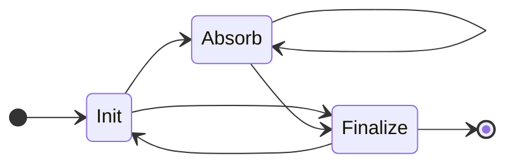

# Keccak256 For Variable Length Input

We describe the circuit that can process inputs of an arbitrary size.

## Plain Keccak behavior

Keccak256 uses a simple iterating sponge construction to handle a variable length input. The sponge absorbs 17 words(136 bytes) of inputs, applies the `Keccak-f` permutation, and then absorb next 17 words. Once all parts of the inputs are absorbed, the sponge squeezes out the 32 bytes for the output.

No matter what input is, the padding must be applied. The padding is a multi-rate padding, it pads single bit 1 followed by minimum number of bits 0 followed by a single bit 1, such that the result is 136 bytes.

## Circuit behavior

### Gadget: Keccak Output Lookup

Each row other than the first is corresponding to a `Keccak-f` permutation round.

We define these state tags
- Init: When a new hash job is initiated
- Absorb: Absorbs non-zero inputs in this permutation
- Finalize: The hash ends here. The output is ready for the consumer to use.



#### State transition

- [*] --> Init first row must be init.
- After the init, it could be Absorb or Finalize
- After the Finalize, the next must be Init or EndOfTheCircuit


We leave an empty row at the top of the table for usage that disables the lookup

This region splits the input to multiple parts, each part corresponds to their `Keccak-f` permutation round.
This is also a lookup table for the other circuits to lookup the Keccak256 input to the output.

Define:

We use `Round` for the cells of the following columns in a row, it represents the information in a `keccak_f` round.

The `curr: Round` and `next: Round` represent the current and the next row.

Columns:

- `state_tag` either 0=None, 1=Init, 2=Absorb, 3=Finalize
- `input_len` Length for correct padding
- `input` 136 bytes to be absorbed in this round
- `acc_len` How many length we have absorbed
- `acc_input` Accumulatd bytes by random linear combination (in big-endian order)
- `output` The base-2 `state[:4]` output from this round `keccak_f`
- `output_word_[n]` 25 columns of the output in words of this round `keccak_f`

| state_tag | input_len | input | acc_len | acc_input | output |
| ---------:| ---------:| -----:| -------:| ---------:| ------:|
|         0 |         0 |     0 |       0 |         0 |      0 |
|      Init |        20 |       |     136 |           |        |
|  Finalize |        20 |       |     136 |           |        |
|      Init |       150 |       |     136 |           |        |
|    Absorb |       150 |       |     272 |           |        |
|  Finalize |       150 |       |     272 |           |        |
|      Init |         0 |       |     136 |           |        |
|  Finalize |         0 |       |     136 |           |        |
|      Init |       136 |       |     136 |           |        |
|    Absorb |       136 |       |     272 |           |        |
|  Finalize |       136 |       |     272 |           |        |
|         0 |           |       |         |           |        |

#### Checks

TODO

#### Lookup

To lookup the Keccak256 input to the output, query the following columns:

- `state_tag`
- `input_len`: FQ. This is required because input \[0, 0, 0\] and \[0, 0\] have the same RLC value but different keccak hash outputs.
- `acc_input`: RLC
- `output`: RLC

When the lookup is needed, constrain `state_tag === 3 (Finalize)`.

#### Prover behavior

If the prover uses less `Round`s than the circuit provides, the prover should add a dummy hash that has an input size to use all rest of the `Round`s.

### Gadget: Padding Validator

Note that we define a new `acc_len` which increments byte by byte, where the `acc_len` in the lookup region bumps by 136 bytes.

#### Plain behavior: The padding rule

```python
def get_padding(acc_len) -> bytes:
    """
    output big-endian bytes
    """
    # note that diff is at maximum 135
    diff = 136 - acc_len
    if diff == 0:
        # pad the next full block
        return [0x80] + ([0x00] * 134) + [0x01]
    elif diff == 1:
        # pad 0b10000001
        return [0x81]
    elif 1 < diff < 136:
        return [0x80] + ([0x00] * int(diff - 2)) + [0x01]
    else:
        raise ValueError("unreachable")
```

#### Circuit

The Padding Region is a 136-row region.

- `byte` individual byte of the input in big-endian
- `input_len` Length for correct padding
- `acc_len` How many bytes we have processed
- `condition_80_inv` The inverse of `input_len - acc_len` or 0.
- `padded_byte` Mostly the same as the original `byte` but padded
- `is_pad_zone` A flag to define the rows that `byte` should be 0
- `byte_RLC` This accumulate `byte` into RLC

| offset | byte | input_len | acc_len | condition_80_inv | padded_byte | is_pad_zone | byte_RLC |
| -----: | :--- | --------: | ------: | ---------------: | :---------- | ----------: | -------- |
|      0 | 0xff |       250 |     136 |                  | 0xff        |           0 |          |
|      1 | 0xff |       250 |     137 |                  | 0xff        |           0 |          |
|      2 | 0xff |       250 |     138 |                  | 0xff        |           0 |          |
|      3 | 0xff |       ... |     ... |                  | 0xff        |           0 |          |
|      4 | 0xff |       250 |     249 |                1 | 0xff        |           0 |          |
|      5 | 0xff |       250 |     250 |                0 | 0xff        |           0 |          |
|      6 | 0x00 |       250 |     251 |               -1 | 0x80        |           1 |          |
|    ... | ...  |       ... |     ... |              ... | ...         |         ... |          |
|    134 | 0x00 |       250 |     270 |                  | 0x00        |           1 |          |
|    135 | 0x00 |       250 |     271 |                  | 0x01        |           1 |          |

#### Checks

Generally we want these properties:

1. `byte` after `input_len` should be 0, so that prover doesn't cheat about the input length. For exapmle, the prover specify an input length of 100 bytes, so that it shouldn't have a non-zero byte at position 120.
2. The padding `0x80`, `0x01`, or `0x81` are placed at the correct place.

We apply two different checks on the 0~134-th rows and the 135th row.

1. For 0-th row
   1. `input_len` is copied from the Lookup Region
   2. `acc_len` is copied from the Lookup Region
   3. `curr.is_pad_zone === 0`
2. For all rows
   1. If `is_pad_zone` then `byte === 0`. `is_pad_zone * byte === 0`
3. For 0~134-th rows
   1. `next.input_len === curr.input_len`
   2. `next.acc_len === curr.acc_len + 1`
   3. Inverse check for `curr.condition_80_inv`
   4. If `curr.input_len - curr.acc_len` is 0, pad `0x80`: `curr.padded_byte === curr.byte + (1 - (curr.input_len - curr.acc_len) * curr.condition_80_inv) * 0x80`
   5. Set `is_pad_zone` to 1 if we entered. `next.is_pad_zone === curr.is_pad_zone + (1 - (next.input_len - next.acc_len) * next.condition_80_inv)`
4. For the 135th row
   1. Same as the previous 0x80 pad, but pad 0x01 if we are in the pad zone. `curr.padded_byte === curr.byte + (1 - (curr.input_len - curr.acc_len) * curr.condition_80_inv) * 0x80 + is_pad_zone * 0x01`
5. Use `byte_RLC` to running sum `byte`. The sum should be equal to `input` in the lookup region
6. `padded_byte` are copied to a word builder gadget to build padded words, which would later be copied to the `Keccak-f` permutation
