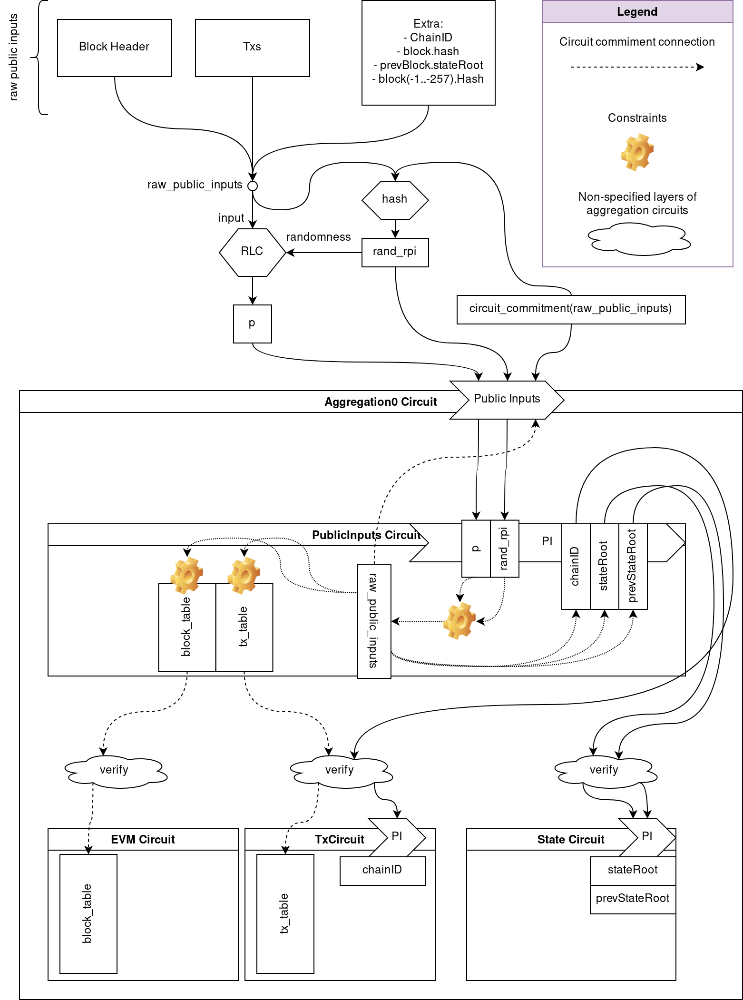

# Public Inputs

The following list contains all the data used by an Ethereum client to
calculate a block and to define this calculated block.

## Block

- Hash: 256 bits
- Block Fields used in RLP:
    - ParentHash: 256 bits
    - UncleHash: 256 bits
    - Coinbase: 160 bits
    - Root: 256 bits (State Trie Root)
    - TxHash: 256 bits (Txs Trie Root)
    - ReceiptHash: 256 bits (Receipts Trie Root)
    - Bloom: 256 bytes
    - Difficulty: 256 bits
    - Number: 64 bits
    - GasLimit: 64 bits
    - GasUsed: 64 bits
    - Time: 64 bits
    - Extra: 0 bytes
    - MixDigest: 256 bits
    - Nonce: 64 bits
    - BaseFee: 256 bits (BaseFee was added by EIP-1559 and is ignored in legacy headers.)

### Circuits

- Block Hash verifier
    - All fields
- EVM Circuit Block Table
    - Coinbase
    - GasLimit
    - Number
    - Time
    - Difficulty
    - BaseFee
- State Circuit
    - Block.Root

## Previous Blocks

- block[-1].Root: 256 bits
- block[-1..-257].Hash: 256 x 256 bits

### Circuits

- EVM Circuit Block Table
    - block[-1..-257].Hash
- State Circuit
    - block[-1].Root

## Globals

- ChainID: 64 bits

### Circuits

- EVM Circuit Block Table
    - ChainID
- TxCircuit
    - ChainID

## Transactions

NOTE: Currently we only consider the legacy transaction defined in
[EIP-1559](https://eips.ethereum.org/EIPS/eip-1559)

- Nonce: 64 bits
- GasPrice: 256 bits
- Gas: 64 bits
- CallerAddress: 160 bits
- CalleeAddress: 160 bits
- IsCreate: 1 bit
- Value: 256 bits
- CallDataLength: 64 bits
- CallData: CallDataLength bytes
- TxSignHash: 256 bits
- Signature
    - v: 256 bits
    - r: 256 bits
    - s: 256 bits

Fields used for RLP for TxSignHash:
- Nonce
- GasPrice
- Gas
- CalleeAddress
- Value
- CallData
- ChainID

Fields used for RLP for TxHash:
- Nonce
- GasPrice
- Gas
- CalleeAddress
- Value
- CallData
- ChainID
- Signature.v
- Signature.r
- Signature.s

### Circuits

- TxCircuit
    - All Fields

# Necessary public Data

Some of the data defined in the previous section will be available along with
the proof when it is submitted for verification.  More data than strictly
necessary to verify a proof will be included in order to allow a node to
synchronize the State Trie.

## Data to synchronize the State Trie

In order to synchronize the State Trie after a new block (assuming we have the state
of the previous block), we need the at least the following data:

- For each tx
    - GasPrice: 256 bits
    - Gas: 64 bits
    - CallerAddress: 160 bits
    - CalleeAddress: 160 bits
    - Value: 256 bits
    - CallData: CallDataLength bytes
- Block fields that affect EVM execution
    - Coinbase: 160 bits
    - Difficulty: 256 bits
    - Number: 64 bits
    - GasLimit: 64 bits
    - Time: 64 bits
    - BaseFee: 256 bits
- Extra fields that affect EVM execution
    - block[-1..-257].Hash
    - ChainID: 64 bits

The signature is not needed to synchronize the State Trie, and the nonce can be
inferred from the State Trie of the previous block.

## Data to calculate a new block

In order to calculate a new block (assuming we have the state of the previous
block), we need at least the following data:

- A way to prove that block[-1].Root (calculated from the known State Trie) is
  included in block[-1].Hash
    - A simple way to resolve this is by publishing the StateRoot with each
      proof (liked via public input)
    - Another way to resolve this is by publishing all block fields, so that a
      verifier can calculate the block hash in the circuit proving that it uses
      the expected StateRoot.

## Data to verify synchronization

Even though a node may have enough data to synchronize the State Trie, the node
can't verify if the computed State Trie is correct (it's the same used in the
proof).  For that it the following value should be published:

- StateRoot

# Public Input approach

The necessary public data may not be equal to the verification circuit public
inputs.  This is because every circuit public input value has a verification
cost, which should be minimized.

To minimize the circuit public inputs we introduce the idea of the PublicInputs
Circuit, which validates that the necessary public inputs found in the circuit
(as witness) correspond to a previous commitment of these necessary public
inputs, while also setting up this data in the shape that the rest of the circuits
expect (be it as Tables for lookups or as public input values). The
PublicInputs Circuit is verified by the top level aggregation circuit, which is
only required to have a very small amount of public inputs (namely, a challenge
to validate the commitment of the necessary public data).

In more detail:
We have a list of raw public inputs (which includes the necessary public data)
that must reach the aggregation circuit.
We want to minimize the number of public inputs for a circuit to reduce the
verification cost, so we'd like to "compress them" somehow.
There are different possibilities for this "compression".  The most advanced
one involves the new [EIP-4844](https://eips.ethereum.org/EIPS/eip-4844) that
allows cheap generation of data commitments of data sent to Ethereum, that can
later be "uncompressed" (opened) from a contract.

The commitment defined in EIP 4844 uses a different field than our circuits, so
opening it in a circuit is very expensive.  Instead, we must prove the equivalence
of the committed raw public inputs (outisde of the circuits) with the witnessed
raw public inputs (inside the circuits), with the help of the PublicInputs
circuit.

The following steps describe the process:
1. Send `raw_public_inputs` to Ethereum as a blob following EIP 4844
2. Get `commitment_bls=kzg_commitment(raw_public_inputs)`
3. Prove that `commitment_bls` has committed to the same values as the ones
   found in the `raw_public_inputs` advice column in the
   `public_inputs_circuit`.  See
   [here](#Verify-a-KZG-BLS-commitment-inside-a-circuit) for a possible
   approach.
4. `public_inputs_circuit` lays out the advice column `raw_public_inputs` into the `tx_table`, `block_table`, etc.
5. When `Aggregation0` circuit verifies `public_inputs_circuit` proof, it has access to commitments of advice columns corresponding to `tx_table`, `block_table`, etc.  We call these table commitments.
6. `Aggregation0` circuit passes these table commitments around (to other aggregation circuits) until they reach the circuit that uses them
7. aggregation circuit that verifies a circuit that uses a table, uses the table commitment in the verification of the proof.

As a shortcut, for 1, 2 and 3 we do:
1. Calculate `raw_public_inputs` from the necessary public inputs passed via
   calldata in the tx where we call the zkEVM verification function
2. `p = RLC(raw_public_inputs, rand)`
    - `rand = hash(raw_public_inputs, polynomial_commitment(public_inputs_circuit:advice_raw_public_inputs))`

Point 2 requires:
- A. `Aggregation0` must have `rand` and `polynomial_commitment(public_inputs_circuit:advice_raw_public_inputs)` as public input
- B. `public_inputs_circuit` must have `rand` as public input

Notes:
- [1] `Aggregation0` circuit is the top level aggregation circuit which is verified in an L1 contract.
- With this approach, once we cross the `Aggregation0` circuit, the verification cost of each proof is independent of the "real" number of public inputs (i.e. the number of transactions, the size of call data, the number of block fields, etc.)
- Calculating an RLC of values in a contract is cheap (it just needs `MULMOD`, `ADDMOD`)

The following diagram shows the the public input approach using the RLC shortcut:

## Verify a KZG BLS commitment inside a circuit

Here's a proposal to prove that the commitment using KZG with a BLS curve (as
defined in EIP 4844) uses the same values as the ones found in an advice column
of a circuit:

1. Pick random `x`
2. Evaluate the polynomial used in `commitment_bls` at `x` and get `y`.  So
   `verify_kzg_bls_proof(commitment_bls, x, y, quotient_kzg) == True`, where
   `y` is in modulus of BLS
2. Pass `(x, y)` into the aggregation circuit (as public inputs)
3. Pass `(x, y)` into the `public_inputs_circuit` (as public inputs)
4. `public_inputs_circuit` contains a column with `raw_public_inputs`
5. Inside the circuit, evaluate the polynomial defined with `raw_public_inputs`
   as its Lagrange coefficients in the BLS modulus at `x` and verify that the
   result is `y`.
   We use the [barycentric formula](https://en.wikipedia.org/wiki/Lagrange_polynomial#Barycentric_form)
   to evaluate the polynomial using its Lagrange coefficients efficiently.

How to pick the random challenge `x`:
- `x = hash(commitment_bls(raw_public_inputs) || poly_commitment(PublicInputsCircuit:raw_public_inputs))`

This is because:
- The prover shouldn't know x before the `commitment_bls` is calculated
- The prover shouldn't know x before the witness `PublicInputsCircuit:raw_public_inputs` is committed
- In summary: the prover shouldn't be able to change any of the commitments
  after it learns about `x`, otherwise the prover is able to construct a polynomial
  with values different than `raw_public_inputs` that evaluates to `y` on `x`.

# PublicInputs Circuit

## Setup

All the necessary public data is arranged in a single array of elements (called
`raw_public_inputs`), following the layout of the `block_table` `value` column,
`tx_table` {`tx_id`, `index`, `value`} columns, and extra fields in between.

## Public Inputs

- `rand_rpi`: Randomness used to "compress" the raw public inputs
- `rpi_rlc`: Random Linear Combination of the raw public inputs (using `rand_rpi` as randomness)
- `chain_id`: Chain ID, used to match the Chain ID public input used in the Tx Circuit
- `state_root`: State Root of current block, used to match the State Root of current block public input used in the State Circuit
- `state_root_prev`: State Root of previous block, used to match the State Root of previous block public input used in the State Circuit

## Behaviour

First, the circuit calculates the Random Linear Combination of a column
containing the raw public inputs array, and verifies that the result matches
the `rpi_rlc` passed via public inputs using `rand_rpi` as randomness.

Second, the circuit proves that the contained `block_table -> value` and
`tx_table -> {tx_id, index, value}` columns correspond to the correct sections
of the raw public inputs column.

Finally, the circuit proves that the `chain_id`, `state_root` and
`state_root_prev` in the public inputs are found in the correct offset in the
raw public inputs column.

## Code

NOTE: The current code only uses the block fields (in the `raw_public_inputs`)
required by the `block_table` (used by the EVM circuit).  In the future we want
to calculate the block hash in a circuit, so we will need to extend the block
fields to match every field found in the block header.

NOTE: The Word values (256 bits) that appear in the `raw_public_inputs` are not
RLC encoded because we may use a different approach to encode Words to avoid
requiring a shared randomness among all circuits.  See
https://github.com/privacy-scaling-explorations/zkevm-specs/issues/216
The reference code temporarily encodes Words in fields (which is insecure due
to collisions), and will be updated once we reach an agreement on issue 216.

Please refer to `src/zkevm-specs/public_inputs.py`.
