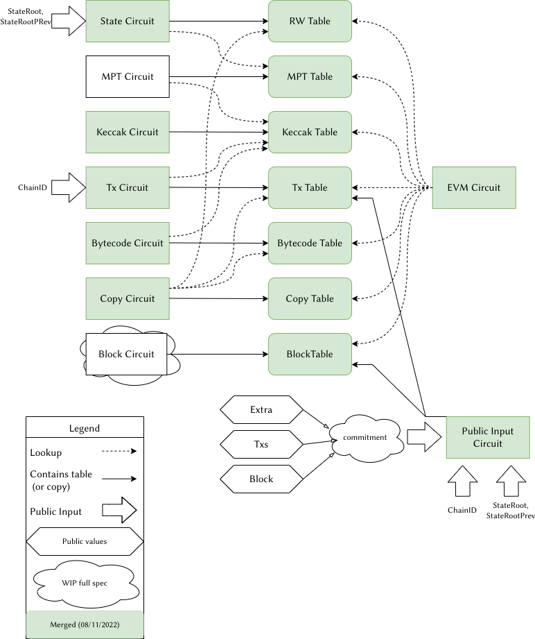

# Super Circuit

The zkEVM is composed of many circuits, each of which is responsible for checking some EVM aspect.
These circuits need to be aggregated or combined together somehow. We could say that the Super
Circuit is one of the possible strategies to combine all other sub-circuits.

The Super Circuit approach is quite simple, all sub-circuits are put together and their tables are
shared among all of them. It contains the following circuits:
 - [x] EVM Circuit
 - [x] State Circuit
 - [ ] MPT Circuit
 - [x] Keccak Circuit
 - [x] Tx Circuit
 - [x] Bytecode Circuit
 - [x] Copy Circuit
 - [ ] Block Circuit
 - [x] PublicInputs Circuit

 and the following tables:
 - [x] RW Table
 - [x] MPT Table
 - [x] Keccak Table
 - [x] Tx Table
 - [x] Bytecode Table
 - [x] Copy Table
 - [x] Block Table

The following diagram shows the relation between these circuits and tables:

**Note**: There are some smaller sub-circuits, like the ECDSA circuit and opcode related
sub-circuits do not interact with other tables and circuits in a way that affects the Super
Circuits, so they are not shown in the diagram for clarity.

Putting together all sub-circuits in one allows them to easily make lookups to whatever table is
necessary without the need of having them copied. The main drawback is that the Super Circuit proof
is very large, and therefore its verification is costly. To alleviate this problem a new circuit is
introduced: the Root Circuit, whose function is to verify the Super Circuit proof, generating a much
smaller proof which is cheaper to verify.
